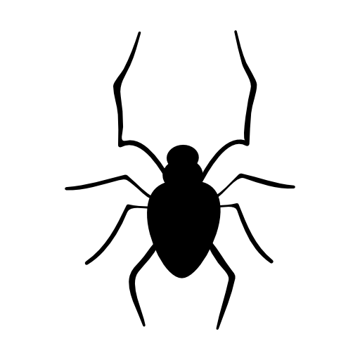

 
.md 书写格式
=================

>强调

*single asterisks*
_single underscores_
**double asterisks**
__double underscores__
>代码

```
我是代码，
我是代码
```
>链接

   [This link](http://example.net/) has no title attribute.
    
   如果你是要链接到同样主机的资源，你可以使用相对路径：
    
   See my [About](/about/) page for details.
   

>字符的原型

###表格

| 符号  | 转换码   |
|:-----:|:--------:|
| &     |&amp;amp; |
| <     |&amp;lt;  |
| ©     |&amp;copy;|
| ```   | ``` hellow word  ``` |
| #     | 个数 H1-h6 | 
| \>    | 标签 |
| * + - | 无序列表 |
| 1.  2. | 有序列表 数字接着一个英文句点 |
| \!\[Alt text\](imgPath title) |   这是图片 |
| \[This link\](url)            | [This link](http://example.net/) 这是链接 |


~~删除我吧~~


>标签

有序列表则使用数字接着一个英文句点：
> ## 这是一个标题。
> 
> 1.   这是第一行列表项。
> 1.   这是第二行列表项。

无序列表使用星号、加号或是减号作为列表标记：
*   Red
+   Red
-   Red

>H1 - H6

This is an H1
=============
This is an H2
-------------

# 这是 H1  1到6个#代表 H1-H6
## 这是 H2
###### 这是 H6


>代码

```
我是代码，
我是代码
```
>图片

 很明显地，要在纯文字应用中设计一个「自然」的语法来插入图片是有一定难度的。
 
 
 


>以下这些符号前面加上反斜杠来帮助插入普通的符号：
```
\   反斜线
`   反引号
*   星号
_   底线
{}  花括号
[]  方括号
()  括弧
#   井字号
+   加号
-   减号
.   英文句点
!   惊叹号
```